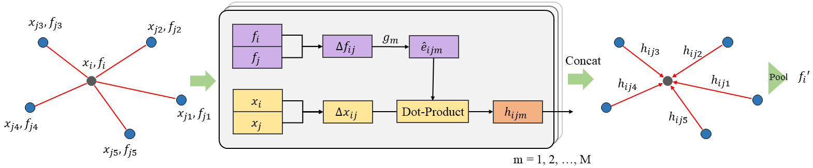

# Adaptive Graph Convolution for Point Cloud Analysis

This repository contains the implementation of **AdaptConv** for point cloud analysis.

Adaptive Graph Convolution (AdaptConv) is a point cloud convolution operator presented in our ICCV2021 [paper](https://arxiv.org/abs/2108.08035). If you find our work useful in your research, please cite our paper.

preprint:

    @article{zhou2021adaptive,
      title={Adaptive Graph Convolution for Point Cloud Analysis},
      author={Zhou, Haoran and Feng, Yidan and Fang, Mingsheng and Wei, Mingqiang and Qin, Jing and Lu, Tong},
      journal={arXiv preprint arXiv:2108.08035},
      year={2021}
    }

## Installation

* The code has been tested on one configuration:
    - PyTorch 1.1.0, CUDA 10.1

* Install required packages:
    - numpy
    - h5py
    - scikit-learn
    - matplotlib

## Classification

[classification.md](./cls/classification.md)

## Part Segmentation

[part_segmentation.md](./part_seg/part_segmentation.md)

## Indoor Segmentation

[sem_segmentation.md](./sem_seg/sem_segmentation.md)

### Updates
* 09/30/2021: Updated code for part segmentation.
* 09/30/2021: Added code for S3DIS indoor segmentation.

